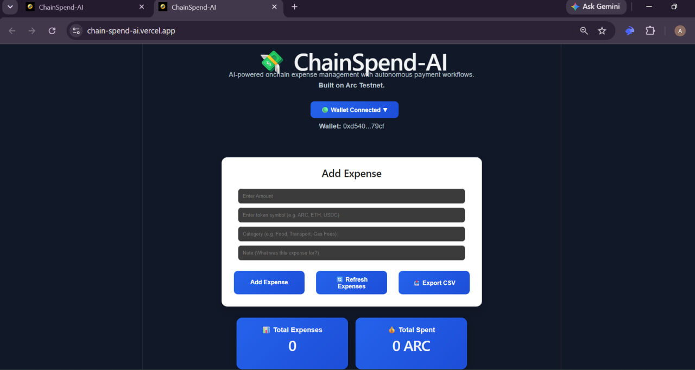
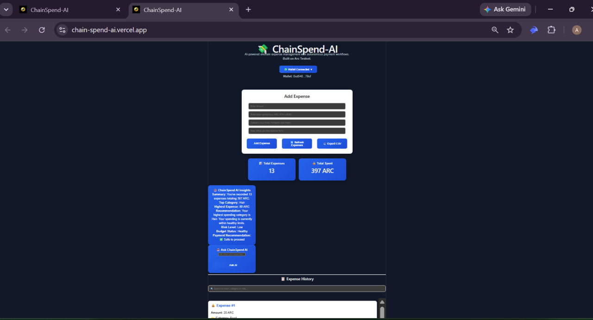
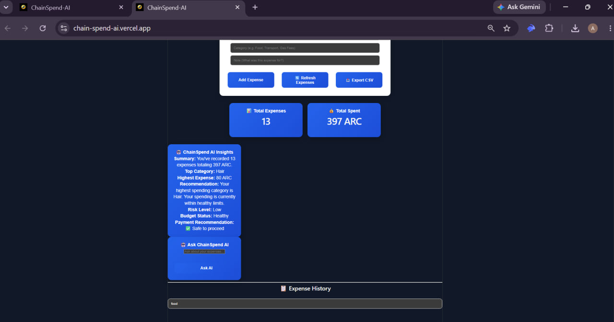
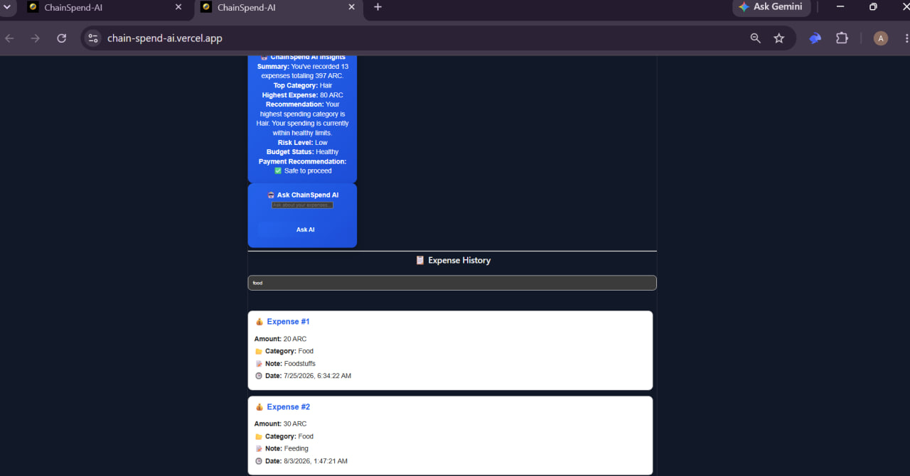
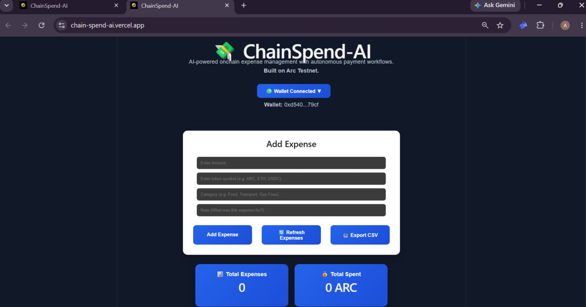
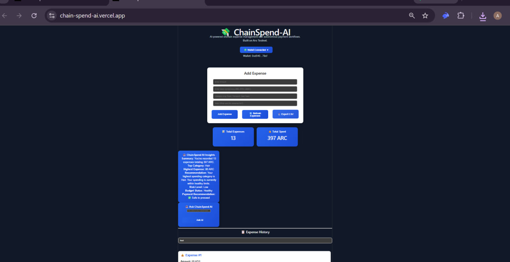

# 🤖 ChainSpend-AI

### AI-Powered Web3 Financial Management on Arc Testnet

ChainSpend-AI is an AI-powered Web3 expense management platform built on Arc Testnet.

It enables users to securely record expenses on-chain while providing intelligent spending insights, financial summaries, searchable expense history, CSV export, and AI-assisted recommendations.

By combining blockchain transparency with AI-powered financial analysis, ChainSpend-AI helps users better understand, organize, and manage their Web3 finances while laying the foundation for autonomous payment workflows.

## Autonomous USDC Expense Agent on Arc

ChainSpend AI is an AI-powered decentralized expense management platform built on Arc.

It combines blockchain transparency, programmable money, and intelligent financial automation to help users securely record expenses onchain while laying the foundation for autonomous financial decision-making.

Built for the **Arc Agentic Economy Hackathon**.

---

# 🌐 Live Demo

Live Application

**Current Prototype (Arc Foundation)**

https://chain-spend-ai.vercel.app

Experience ChainSpend-AI by connecting any EVM-compatible wallet on Arc Testnet.

Supported wallets include:

- Rabby Wallet
- MetaMask
- OKX Wallet
- Zerion Wallet
  > This live demo showcases the current on-chain expense tracking foundation. AI-powered autonomous capabilities are actively being developed as part of ChainSpend AI.

---

# 🎯 Problem

Managing expenses is still largely manual.

Users must:

- Track spending manually
- Monitor budgets
- Remember recurring payments
- Review every transaction

Traditional expense trackers only record history—they don't help users make financial decisions.

---

# 💡 Solution

ChainSpend AI evolves expense tracking into an intelligent financial assistant.

The platform combines blockchain transparency with AI-driven decision support to help users:

- Track expenses securely onchain
- Analyse spending patterns
- Detect unusual transactions
- Recommend smarter budgeting
- Prepare for programmable USDC payment automation

---

# ✨ Current Features

### ⛓️ On-Chain Expense Management

- 🔐 Connect any EVM-compatible wallet
- 💰 Record expenses securely on-chain
- 📂 Organize expenses by category
- 📝 Add notes to every transaction
- 📊 View total spending and expense history
- 🔍 Search previous expenses
- 🔄 Refresh on-chain records
- 📤 Export expense history as CSV

### 🤖 AI Features

- 🧠 AI-generated spending insights
- 📈 Spending summaries
- 💡 Budget recommendations
- 🚨 Spending risk assessment
- 🤖 AI-powered financial assistant

## Product Preview

### Home



### Dashboard



### AI Spending Analysis



### Search



### Wallet Connection



### CSV Export



### ⚡ Platform

- ⚡ Built on Arc Testnet
- 🔒 Wallet-specific on-chain records
- # 🌐 Responsive Web3 interface
- 🔐 Wallet-based authentication
- 💰 Record crypto expenses on-chain
- 📂 Categorize expenses
- 📝 Add notes to every expense
- 📊 Dashboard showing total expenses and total spending
- 🔍 Search expense history
- 🔄 Automatic expense refresh
- 📤 Export expenses as CSV
- ⚡ Powered by Arc Testnet

---

# 🧠 AI Roadmap

Arc provides a fast, secure, and EVM-compatible environment that enables developers to build next-generation decentralized applications using familiar Ethereum tooling.

ChainSpend-AI leverages Arc to deliver:

- ⚡ Fast and low-friction on-chain transactions
- 🔒 Secure, wallet-specific expense records
- 📖 Transparent and verifiable financial history
- 🤖 A reliable foundation for AI-powered financial intelligence
- # 🚀 Scalable infrastructure for future autonomous payment workflows

  The AI Decision Engine is planned to provide:

- 🤖 Smart expense categorization
- 📊 AI spending insights
- 💡 Budget recommendations
- 🚨 Unusual spending detection
- 🔁 Recurring payment automation
- 💵 Circle USDC payment workflows
- 🧠 Autonomous financial assistance

---

# 🚀 Why Arc?

Arc provides a secure EVM-compatible blockchain for building autonomous financial applications.

ChainSpend AI leverages Arc to provide:

- Transparent on-chain expense records
- Wallet-specific expense history
- Secure transaction storage
- Fast transaction confirmation
- A scalable foundation for AI-powered finance

---

# 🌍 Vision

ChainSpend-AI aims to become an intelligent financial companion for Web3 users.

Beyond simply recording expenses, the platform is designed to help users understand their spending habits through AI-powered analysis, actionable recommendations, and future autonomous payment workflows.

Our long-term vision is to combine blockchain transparency with artificial intelligence to create a secure, intelligent, and user-owned financial management experience that works seamlessly across multiple EVM-compatible networks.

Our vision is to build an autonomous financial assistant where AI agents help users monitor expenses, recommend financial decisions, and eventually automate trusted USDC payments while keeping users in control.

---

# 🛣 Roadmap

### Current

- ✅ On-chain expense tracking
- ✅ Wallet integration
- ✅ AI spending insights
- ✅ Searchable expense history
- ✅ CSV export
- ✅ Responsive dashboard

### Next Phase

- 🤖 Smarter AI financial recommendations
- 💳 Autonomous recurring payment workflows
- 📈 Predictive spending analysis
- 🌐 Multi-chain expense management
- 📅 AI-generated financial reports
- 🚨 AI anomaly and fraud detection

---

## 📡 Smart Contract Deployment

## ✅ Phase 1 (Current)

- Wallet Connection
- On-chain Expense Tracking
- Dashboard
- Expense Search
- CSV Export
- Automatic Refresh

## 🚧 Phase 2

- AI Expense Categorization
- Spending Insights
- Budget Recommendations
- Spending Analytics

## 🚀 Phase 3

- Circle USDC Integration
- Autonomous Payment Rules
- AI Financial Assistant
- Cross-chain Financial Management

---

# 📡 Live Deployment

| Network     | Contract Address                           |
| ----------- | ------------------------------------------ |
| Arc Testnet | 0x72EC997ffB25D63F430A95c69a0B93F5F2d90131 |

---

## 📁 Project Structure

ChainSpend-AI/
├── contracts/
│ └── ExpenseTracker.sol
├── scripts/
│ ├── compile.js
│ └── deploy.js
├── frontend/
│ ├── src/
│ │ ├── components/
│ │ ├── lib/
│ │ ├── App.jsx
│ │ └── main.jsx
│ ├── public/
│ ├── package.json
│ └── vite.config.js
├── build/
├── .env
├── package.json
└── README.md

---

## 🛠 Tech Stack

### Frontend

- React
- Vite

### Blockchain

- Solidity
- Ethers.js
- # Arc Testnet

# 🛠 Tech Stack

### Blockchain

- Arc Testnet
- Solidity
- Ethers.js

### Frontend

- React
- Vite
- JavaScript

### Wallet

- Rabby Wallet
- MetaMask (EVM Compatible)

### AI (Planned)

- AI Decision Engine
- Spending Intelligence
- Budget Analysis
- Financial Recommendations

### Wallet Integration

- MetaMask
- Rabby Wallet
- OKX Wallet
- Zerion Wallet

### Deployment

- Vercel

### AI Features

- AI-powered spending insights
- Intelligent financial recommendations
- Spending analysis

---

# 📁 Project Structure

git clone https://github.com/idriskinze86/ChainSpend-AI.git

## cd ChainSpend-AI

## ⚙️ Environment Variables

Create a .env file in the project root.

RPC_URL=https://rpc.testnet.arc.network
PRIVATE_KEY=YOUR_PRIVATE_KEY

> # ⚠️ Never commit your private key or any sensitive information to GitHub.

```
ChainSpend-AI/
├── contracts/
├── frontend/
├── scripts/
├── screenshots/
├── DEPLOYMENTS.md
├── package.json
├── README.md
└── LICENSE
```

---

# 🌐 Clone Repository

```bash
git clone https://github.com/idriskinze86/ChainSpend-AI.git
cd ChainSpend-AI
```

---

# ⚙️ Installation

## Install dependencies

```bash
npm install
```

## Install frontend

```bash
cd frontend
npm install
npm run dev
```

## Compile contract

```bash
cd ..
node scripts/compile.js
```

## Deploy contract

## node scripts/deploy.js

## 📜 Smart Contract

### Contract Name

ExpenseTracker

The ExpenseTracker smart contract is the core of ChainSpend-AI. It securely records expense transactions on Arc Testnet, ensuring every user's financial records remain transparent, immutable, and wallet-specific.

Each connected wallet maintains its own independent expense history, allowing users to securely track, retrieve, search, and analyze their on-chain spending without exposing or mixing records with other users.

### Core Functions

| Function          | Description                                                            |
| ----------------- | ---------------------------------------------------------------------- |
| addExpense()      | Records a new expense on-chain.                                        |
| getExpenses()     | Retrieves all expenses belonging to the connected wallet.              |
| getExpenseCount() | Returns the total number of expenses recorded by the connected wallet. |

The smart contract is designed to provide a reliable on-chain data layer that powers the AI-driven financial insights and expense management features of ChainSpend-AI.

```bash
node scripts/deploy.js
```

---

# 📖 How It Works

| Property        | Value       |
| --------------- | ----------- |
| Network         | Arc Testnet |
| Chain ID        | 5042002     |
| Currency Symbol | ARC         |

---

## 📖 How It Works

1. Connect an EVM-compatible wallet (MetaMask, Rabby, OKX, or Zerion).
2. Switch to Arc Testnet.
3. Record an expense by entering:
   - Amount
   - Token
   - Category
   - Note
4. Confirm the transaction in your wallet.
5. The expense is securely stored on-chain.
6. View your wallet-specific expense history.
7. Search and filter previous expenses.
8. Export your records as a CSV file.
9. Review AI-generated spending insights and recommendations.

---

## 🔮 Future Roadmap

ChainSpend-AI is designed to evolve into an autonomous financial assistant for Web3 users.

### Planned Features

- 🤖 Smarter AI financial recommendations
- 📊 Advanced spending analytics and visualizations
- 📅 AI-generated monthly financial reports
- 💳 Autonomous recurring payment workflows
- 🌐 Multi-chain expense management
- 🔗 Cross-chain expense synchronization
- 🚨 AI-powered anomaly and fraud detection
- 📈 Predictive budgeting and spending forecasts
- # 🔍 Natural language expense search

1. Connect your EVM wallet.
2. Switch to Arc Testnet.
3. Add an expense.
4. Confirm the transaction.
5. Expense is stored onchain.
6. Dashboard refreshes automatically.
7. Search previous expenses.
8. Export expenses as CSV.

---

# 🔮 Future Improvements

- 🤖 AI expense categorization
- 📊 AI-generated spending insights
- 💡 Budget recommendations
- 🚨 Spending anomaly detection
- 💵 Circle USDC integration
- 🔁 Recurring payment automation
- 🧠 Autonomous payment approvals
- 🌉 Cross-chain financial management

---

# 🤝 Contributing

Contributions, feedback, and ideas are welcome.

Feel free to fork the repository, create a feature branch, and submit a pull request.

---

# 🔗 Project Links

- 🌐 Live Demo: https://chain-spend-ai.vercel.app/
- 💻 GitHub Repository: https://github.com/idriskinze86/ChainSpend-AI
- # ⛓️ Network: Arc Testnet
- 🌐 Live Demo: https://chain-spend-arc.vercel.app/
- 💻 GitHub Repository: https://github.com/idriskinze86/ChainSpend-AI

---

# 🙌 Acknowledgements

ChainSpend-AI was built for the Arc ecosystem to demonstrate how blockchain and AI can work together to simplify on-chain financial management.

Special thanks to the Arc team for providing the infrastructure and developer tools that made this project possible, and to the Web3 open-source community for the libraries and resources that accelerated development.

Built for the **Arc Agentic Economy Hackathon**.

ChainSpend AI explores how AI agents, programmable money, and blockchain technology can simplify personal finance while leveraging Arc's infrastructure.

The current implementation provides the on-chain expense management foundation, while AI-powered autonomous financial capabilities are actively being developed.

## Built with ❤️ using Solidity, React, Vite, Ethers.js, and Arc Testnet.

# 📄 License

This project is licensed under the MIT License.

You are free to use, modify, and distribute this software in accordance with the terms of the MIT License.
